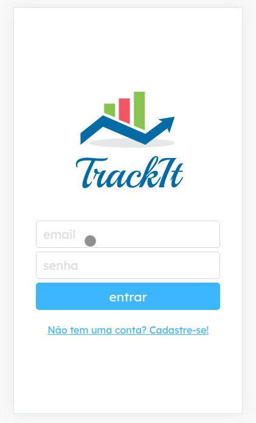

<h1 align="center">
    Track It
</h1>

## About

Track it is an application that helps you to easily create and maintain good and healthy habits.<br>

The focus of this project is to further develop Front End skills and the concept of single-page applications, changing from vanilla JavaScript to React, using HTML5, CSS3 (with styled-components lib) and React itself. <a href="https://track-it-kappa.vercel.app" target="_blank">Or view here!</a>

---

## Features

-   [x] Mobile Layout

-   [x] Homepage (Today) experience:

    -   [x] Load the list of habits assigned for the current day;
    -   [x] Mark habits done or undone;
    -   [x] Track the percentage of completed habits;

-   [x] Habits session

    -   [x] Show all registered habits;
    -   [x] Let you create and erase habits;

-   [x] History session

    -   [x] Future session, to be implemented, that shows a calendar with highlighted color indication that differentiates days by habits accomplishment;

---

## Layout

The application layout is available on Figma:

<a href="https://www.figma.com/file/3r8MSf9dIPuFlvZHuHTZXF/TrackIt?node-id=0%3A1">
  
</a>

### Demo (Mobile)

<p align="center">
  
</p>

## Tech Used

The following tools were used in the construction of the project:

-   **[](https://reactjs.org/)**
-   **[](https://html5.org/)**
-   **[](https://www.w3.org/Style/CSS/Overview.en.html)**
-   **[](https://www.javascript.com/)**

#### **Utilities**

-   Prototype: **[Figma](https://www.figma.com/)** → **[Prototype (Track It)](https://www.figma.com/file/rc7ZTYfLZg9zpGahWB1aXb/Cineflex?node-id=0%3A1)**
-   Editor: **[Visual Studio Code](https://code.visualstudio.com/)**
-   Fonts: **[Lexend Deca](https://fonts.google.com/specimen/Lexend+Deca)**, **[Playball](https://fonts.google.com/specimen/Playball)**

---

## How to run

1. Clone this repository
2. Install dependencies

```bash
npm i
```

3. Create .env file in origin and insert

```bash
REACT_APP_API_BASE_URL="https://mock-api.bootcamp.respondeai.com.br/api/v2/trackit"
```

4. Run the front-end with

```bash
npm start
```

## Authors

<p>
<a style="border-radius: 50px;" width="100px;" href="https://github.com/carmoandre">
 
 <br />
 <sub><b>André Carmo</b></sub></a>
 <br />

## </p>

## License

👋🏽 Get in Touch!

---
